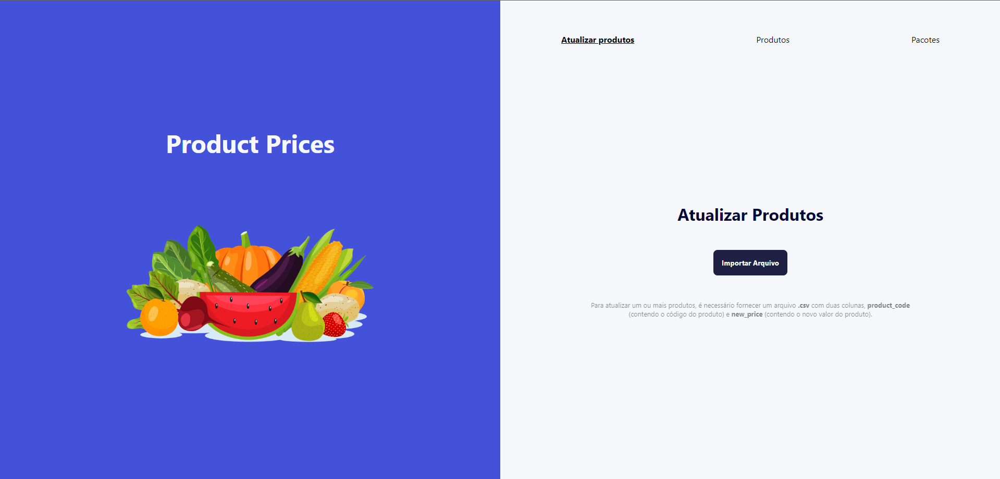

# Online Store

Trata-se de uma aplicação utilizada para atualizar o valor de determinados produtos, onde é possível validar as informações enviadas para atualizar os produtos e, caso os dados estejam de acordo com o padrão, atualizar uma listagem de produtos. Também é possível visualizar a list ade produtos e pacotes disponíveis. A aplicação depende da API disponível [aqui](https://github.com/danielbped/product-price-api).

# Sumário
- [Licença](#licenca)
- [Tecnologias utilizadas](#tecnologias)
- [Instruções para rodar o projeto](#instrucoes)
  - [.env](#env)
- [Demonstração](#demo)

## Licença <a name="licenca"></a>
Este projeto está sob licença do [MIT](https://github.com/danielbped/product-price/blob/master/LICENSE)

## Tecnologias utilizadas <a name="tecnologias"></a>
- [**ReactJS**](https://react.dev/): Uma biblioteca JavaScript de código aberto utilizada para construir interfaces de usuário (UI). Desenvolvida pelo Facebook, ela é baseada em componentes reutilizáveis, permitindo a construção de interfaces dinâmicas e interativas de forma eficiente.
- [**TypeScript**](https://www.typescriptlang.org/): Um superconjunto de JavaScript que adiciona tipagem estática opcional ao código. Ele ajuda os desenvolvedores a detectar erros mais cedo durante o desenvolvimento e oferece ferramentas avançadas para trabalhar em projetos de grande escala, melhorando a manutenibilidade e escalabilidade do código.
- [**Styled Components**](https://styled-components.com/): Uma biblioteca para React e React Native que permite escrever estilos CSS diretamente dentro de componentes JavaScript. Isso facilita a criação e o gerenciamento de estilos, além de fornecer recursos como props dinâmicas e escopo encapsulado para estilos.
- [**Axios**](https://axios-http.com/ptbr/docs/intro): Uma biblioteca JavaScript para fazer requisições HTTP a partir do navegador ou Node.js. Ele fornece uma API simples e concisa para lidar com solicitações e respostas HTTP, suportando várias funcionalidades, como interceptadores, cancelamento de requisições e transformações de dados.
- [**Vite**](https://vitejs.dev/): Um construtor de aplicações web moderno e rápido, desenvolvido principalmente para projetos usando Vue.js, mas também é compatível com outras estruturas como React e Svelte. Ele oferece um ambiente de desenvolvimento extremamente rápido e eficiente, com recarga rápida (hot module replacement) e suporte a módulos ES.
- [**React Icons**](https://react-icons.github.io/react-icons/): Uma biblioteca que fornece um conjunto de ícones populares para serem usados em aplicações React. Ela simplifica a inclusão de ícones vetoriais em projetos React, oferecendo uma ampla variedade de ícones e estilos prontos para uso.
- [**React Spinners**](https://www.davidhu.io/react-spinners/): Uma biblioteca React que fornece componentes para exibir indicadores de carregamento (spinners) em aplicações web. Ela oferece uma variedade de estilos e opções de personalização para spinners, facilitando a inclusão de feedback visual de carregamento em interfaces de usuário.
- [**React Query**](https://tanstack.com/query/latest): Uma biblioteca para gerenciamento de dados em aplicações React. Ela simplifica o gerenciamento de dados assíncronos, como solicitações HTTP, cache de dados e atualizações em tempo real, fornecendo uma API simples e intuitiva para lidar com esses cenários comuns no desenvolvimento de aplicações web.

## Instruções para rodar o projeto <a name="instrucoes"></a>

### Será necessário ter instalado na sua máquina:

    Git
    Node v20.11.1

- Clone o repositório com o comando **git clone**:

      git clone git@github.com:danielbped/product-price.git

- Entre no diretório que acabou de criar:

      cd product-price

- Para o projeto funcionar na sua máquia, será necessário instalar suas dependências, para isso, utilize **npm install**:

      npm install

- Pronto, agora o projeto está pronto para ser rodado localmente, utilizando o comando **npm run dev**:

      npm run dev

    > ⚠️ A aplicação, por definição, estará rodando na porta 5173 ⚠️

- Na raiz do projeto, há um [arquivo de exemplo](https://github.com/danielbped/product-price/blob/master/public/atualizacao_preco_exemplo.csv) que pode ser utilizado para atualizar os produtos.

  - O arquivo deve ser um **.csv**, com duas colunas **product_code** (contendo o código do produto) e **new_price** (contendo o novo valor do produto), e deve seguir as seguintes regras de negócio:
    - O novo valor não deve ser abaixo do preço de custo do produto.
    - O novo valor não deve ser 10% acima ou 10% abaixo do valor atual do produto.

## .env <a name="env"></a>

Na raiz do projeto, será necessário criar um arquivo .env, com as seguintes informações:

```
  VITE_API_URL=""
```

Um arquivo com estas definições já está presente no projeto, o **.env.example**, para que funcione corretamente, basta renomear para apenas **.env**, e alterar os dados **VITE_API_URL** de acordo com a rota em que a API esteja rodando, provavelmente será **http://localhost:3000**.

## Demonstração <a name="demo"></a>

### Página inicial



### Arquivo adicionado para validação


### Erro ao validar o arquivo

Este tipo de erro pode ser ocasionado por aalgum problema interno do sistema.


### Produtos inválidos


### Produtos validados com sucesso


### Erro ao atualizar os produtos


### Produtos atualizados com sucesso


### Página de pacotes


### Página de pacotes, caso não haja nenhum produto listado


### Página de pacotes, caso haja algum erro ao buscar os pacotes

